<<<<<<< Updated upstream
<div align="center">

# ☁️ Cloud Cost Guardian

**Self-hosted multi-cloud FinOps platform — visibility, guardrails and optimisation for AWS, Azure and GCP spend.**

[](https://github.com/aikanii/Cloud-Cost-Guardian/actions/workflows/ci.yml)


</div>

---

## Table of contents

1. [Architecture diagram](#1-architecture-diagram)
2. [System workflow](#2-system-workflow)
3. [Feature list](#3-feature-list)
4. [API documentation](#4-api-documentation)
5. [Database schema](#5-database-schema)
6. [AI architecture](#6-ai-architecture)
7. [Security considerations](#7-security-considerations)
8. [Testing](#8-testing)
9. [Docker setup](#9-docker-setup)
10. [CI/CD](#10-cicd)
11. [Screenshots](#11-screenshots)
12. [Demo](#12-demo)

---

## 1. Architecture diagram

Cloud Cost Guardian is a two-tier application: a React single-page app talks to a stateless Express API which owns an embedded SQLite database. There are **no native dependencies** — SQLite is provided by Node's built-in `node:sqlite` module — so the whole stack installs with `npm` and ships as a single container.

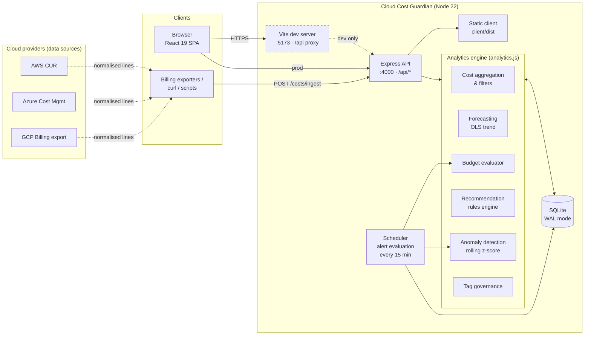

### Component responsibilities

| Layer | Path | Responsibility |
|-------|------|----------------|
| **Web client** | `client/src` | Hash-routed React SPA. Pages under `pages/`, shared primitives in `components/ui.jsx`, API client + formatters in `lib/`. Recharts for visualisation. |
| **API** | `server/src/app.js` | Express router: input validation, HTTP error mapping, CSV streaming, SPA fallback when `client/dist` exists. |
| **Analytics engine** | `server/src/analytics.js` | Pure functions over SQL: aggregation, forecast, anomaly detection, recommendations, budget status, alert evaluation, tag compliance. |
| **Persistence** | `server/src/db.js` | Schema bootstrap (idempotent), prepared-statement helpers, transactions, key/value settings. |
| **Seed** | `server/src/seed.js` | Deterministic (seeded PRNG) demo dataset with injected anomalies, idle resources and untagged assets. |
| **Scheduler** | `server/src/index.js` | Boots DB, seeds if empty, runs alert evaluation on start and on an interval. |

---

## 2. System workflow

### 2.1 Data ingestion → insight

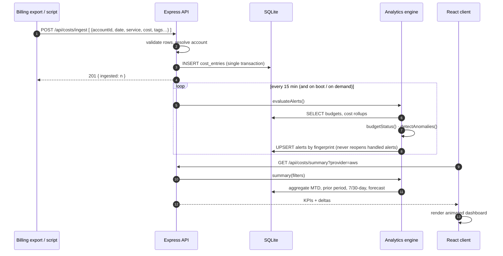

### 2.2 Budget & alert lifecycle

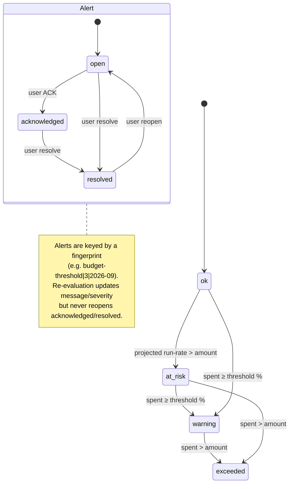

### 2.3 Request pipeline

Every API request flows through: `cors` → `express.json()` → route handler (wrapped in `wrap()` for sync/async error capture) → `buildFilter()` translates query params (`start`, `end`/`days`, `accountId`, `provider`, `service`, `region`, `tag=key=value`) into a parameterised `WHERE` clause → SQL via prepared statements → JSON/CSV response. Errors are normalised to `{ error: string }` with the correct HTTP status by the terminal error middleware.

---

## 3. Feature list

### Visibility
- **Executive dashboard** — month-to-date, forecast month-end, 7-day and 30-day spend with period-over-period deltas; spend by provider (donut), daily spend by service (stacked area), top services, budget health, open alerts, top savings.
- **Cost Explorer** — group daily spend by `service · account · provider · region · team · env · cost-center`; stacked-bar or multi-line view; top-N + "Other" bucketing; sortable breakdown table with share bars; 7/30/60/90-day ranges; CSV export of the exact filtered slice.
- **Global filters** — provider and account filters apply across every page.
- **Resource inventory** — every resource with 30-day cost, CPU utilisation, tags, status and a per-resource cost sparkline; inline tag/status editing.

### Prediction & detection
- **Forecasting** — OLS trend over 60 days, 80 % confidence band that widens with horizon, month-end and next-N-day projections (14/30/60/90).
- **Anomaly detection** — rolling 21-day baseline per (account, service); flags spikes with z > 3, > 40 % increase and > $25 delta; severity tiering.

### Guardrails
- **Budgets** — monthly / quarterly / yearly; scoped to all spend, an account, a service or a tag; configurable threshold; live status `ok → at-risk → warning → exceeded` with run-rate projection.
- **Alerts** — budget threshold, budget forecast-overrun and anomaly alerts; acknowledge / resolve / reopen; evaluated on boot, every 15 minutes, and on demand; sidebar badge with live count.

### Optimisation
- **Savings recommendations** — six rule families with monthly-savings estimate, effort and risk:
  idle compute · unattached volumes · rightsizing · commitment discounts (Savings Plans / CUDs / RIs) · storage lifecycle tiering · missing owner tags.
  Track each as *applied* or *dismissed*; realised-savings KPI.
- **Tag governance** — configurable required-tag policy; compliance % and cost-coverage %; ranked violation list.

### Platform
- Multi-account, multi-provider (AWS, Azure, GCP) model with normalised ingest API.
- Deterministic demo dataset (4 accounts, ~86 resources, 120 days) — every feature works out of the box.
- Animated glassmorphic dark UI with light-mode toggle; `prefers-reduced-motion` respected.
- Single-process production mode (API serves built SPA), Dockerfile, CI pipeline.

---

## 4. API documentation

Base URL: `http://localhost:4000/api`. All responses are JSON unless noted. Errors return `{ "error": "message" }` with `400` (validation), `404` (missing) or `500`.

### Common cost filters

Accepted by every `/costs/*` endpoint:

| Param | Example | Notes |
|-------|---------|-------|
| `start`, `end` | `2026-09-01`, `2026-09-30` | ISO dates, inclusive |
| `days` | `30` | Shortcut for the trailing window (ignored if `start`/`end` given), 1–365 |
| `accountId` | `1` | Internal account id |
| `provider` | `aws` \| `azure` \| `gcp` | |
| `service` | `EC2` | Exact match |
| `region` | `us-east-1` | Exact match |
| `tag` | `team=data` | `key=value`; matched against the entry's JSON tags |

### Endpoints

#### System
| Method | Path | Description |
|--------|------|-------------|
| `GET` | `/health` | `{ ok, time, entries }` |
| `GET` | `/settings` | `{ requiredTags, currency, anomalyZ }` |
| `PUT` | `/settings` | Update any subset of settings |
| `POST` | `/admin/reseed` | Regenerate demo data and re-evaluate alerts |

#### Accounts
| Method | Path | Body / Query | Description |
|--------|------|--------------|-------------|
| `GET` | `/accounts` | — | Accounts with resource count and 30-day cost |
| `POST` | `/accounts` | `{ name, provider, external_id, currency? }` | Connect an account (`provider` ∈ aws/azure/gcp) |
| `DELETE` | `/accounts/:id` | — | Remove account and cascade its data |

#### Costs
| Method | Path | Query | Description |
|--------|------|-------|-------------|
| `GET` | `/costs/summary` | filters | KPIs: MTD, prior-period comparison, 7/30-day, forecast, open alerts, potential savings |
| `GET` | `/costs/daily` | filters | `[{ date, cost }]` |
| `GET` | `/costs/breakdown` | filters + `groupBy` | `[{ key, cost }]` sorted desc. `groupBy` ∈ `service, region, account, provider, team, env, cost-center` |
| `GET` | `/costs/daily-breakdown` | filters + `groupBy` + `limit` | `{ keys: [...top N, "Other"], series: [{ date, <key>: cost }] }` |
| `GET` | `/costs/forecast` | filters + `horizon` (≤ 90) | `{ history, projections[{date, forecast, low, high}], trendPerDay, dailyRunRate, projectedMonthEnd, monthToDate, projectedNext30Days }` |
| `GET` | `/costs/filters` | — | Distinct services, regions, providers, accounts and tag values for UI selectors |
| `GET` | `/costs/export` | filters + `format=csv\|json` | Raw entries; CSV sent as an attachment |
| `POST` | `/costs/ingest` | array of entries | Bulk insert in one transaction |

<details>
<summary><b>Ingest payload</b></summary>

```jsonc
[
  {
    "accountId": 1,                 // required – internal account id
    "date": "2026-09-20",           // required – ISO date
    "service": "EC2",               // required
    "cost": 4.61,                   // required – decimal, account currency
    "region": "us-east-1",          // optional (default "global")
    "usageType": "BoxUsage",        // optional
    "usageQuantity": 24,            // optional
    "tags": { "team": "web", "env": "prod" }   // optional
  }
]
```
Response `201 { "ingested": 1 }`. Any invalid row aborts the whole batch with `400`.
</details>

#### Resources
| Method | Path | Query / Body | Description |
|--------|------|--------------|-------------|
| `GET` | `/resources` | `accountId, service, provider, q` | Inventory with parsed tags and 30-day cost |
| `GET` | `/resources/:id/costs` | `days` | Daily cost for one resource |
| `PATCH` | `/resources/:id` | `{ tags?, status? }` | Update tags / status |

#### Budgets
| Method | Path | Body | Description |
|--------|------|------|-------------|
| `GET` | `/budgets` | — | Budgets enriched with `spent, remaining, pctUsed, projected, projectedPct, status, periodStart, periodEnd, scopeLabel` |
| `POST` | `/budgets` | `{ name, amount, period?, scope_type?, scope_value?, threshold_pct? }` | Create; triggers alert evaluation |
| `PUT` | `/budgets/:id` | partial body | Update |
| `DELETE` | `/budgets/:id` | — | Delete budget and its alerts |

`period` ∈ `monthly | quarterly | yearly` · `scope_type` ∈ `all | account | service | tag` (tag value must be `key=value`) · `threshold_pct` 1–100.

#### Alerts & anomalies
| Method | Path | Query / Body | Description |
|--------|------|--------------|-------------|
| `GET` | `/alerts` | `status, type` | Sorted by severity then recency; `metadata` is parsed JSON |
| `PATCH` | `/alerts/:id` | `{ status }` | `open` \| `acknowledged` \| `resolved` |
| `POST` | `/alerts/evaluate` | — | Run evaluation now → `{ created, total }` |
| `GET` | `/anomalies` | `lookback, z` | Raw detector output (no persistence) |

#### Recommendations & governance
| Method | Path | Query | Description |
|--------|------|-------|-------------|
| `GET` | `/recommendations` | `all=true` to include handled | Sorted by monthly savings |
| `POST` | `/recommendations/:fingerprint/:action` | — | `action` ∈ `applied` \| `dismissed` \| `open` |
| `GET` | `/governance/tags` | `required=env,team` (optional override) | Compliance report with violations |

<details>
<summary><b>Example session</b></summary>

```bash
# KPIs for AWS only
curl -s "localhost:4000/api/costs/summary?provider=aws" | jq

# Daily stacked series by team tag, last 60 days
curl -s "localhost:4000/api/costs/daily-breakdown?groupBy=team&days=60&limit=4" | jq .keys

# Create a service budget with a 75 % warning threshold
curl -s -X POST localhost:4000/api/budgets -H 'content-type: application/json' \
  -d '{"name":"BigQuery","amount":6000,"scope_type":"service","scope_value":"BigQuery","threshold_pct":75}'

# Acknowledge alert 3
curl -s -X PATCH localhost:4000/api/alerts/3 -H 'content-type: application/json' -d '{"status":"acknowledged"}'

# Export September as CSV
curl -o sept.csv "localhost:4000/api/costs/export?start=2026-09-01&end=2026-09-30"
```
</details>

---

## 5. Database schema

SQLite (WAL journal, foreign keys on). Schema is created idempotently on boot by `server/src/db.js`. JSON columns (`tags`, `metadata`) are queried with SQLite's `json_extract`.

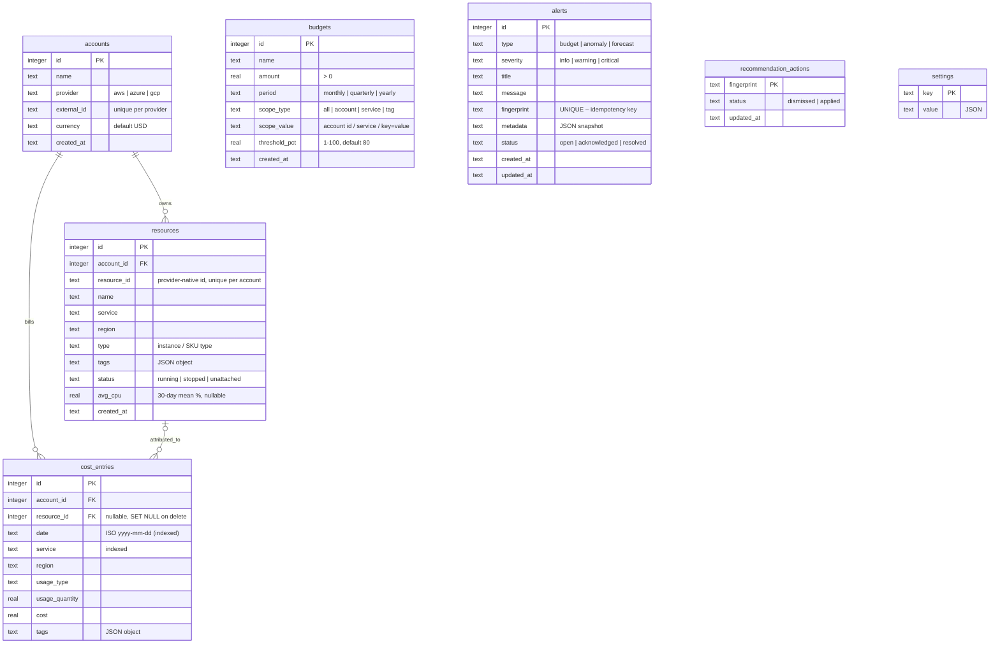

### Indexes & integrity

| Object | Purpose |
|--------|---------|
| `idx_cost_date (date)` | Range scans for every time-windowed query |
| `idx_cost_account_date (account_id, date)` | Per-account rollups, anomaly grouping |
| `idx_cost_service (service)` | Service breakdowns and budget scopes |
| `UNIQUE (provider, external_id)` | Prevents duplicate account connections |
| `UNIQUE (account_id, resource_id)` | Stable resource identity across syncs |
| `alerts.fingerprint UNIQUE` | Makes alert evaluation idempotent (`INSERT … ON CONFLICT DO UPDATE`) |
| `ON DELETE CASCADE` | Removing an account removes its resources and cost lines |

Recommendations are **not persisted** — they are recomputed from live data on each request; only user decisions (`applied` / `dismissed`) are stored, keyed by a deterministic fingerprint such as `rightsize|42` or `commit|1|EC2`.

---

## 6. AI architecture

Cloud Cost Guardian deliberately uses **transparent, explainable statistical models** rather than opaque ML: every number shown to a user can be traced back to a formula and its inputs. All models live in `server/src/analytics.js` and are pure functions of SQL rollups.

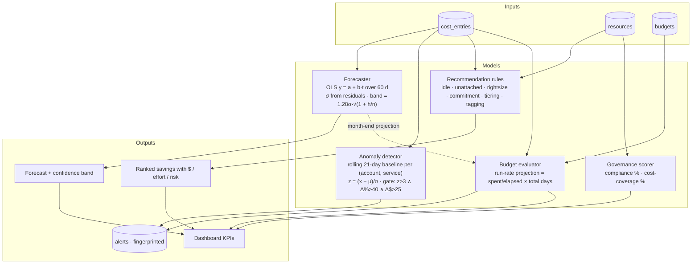

### Model details

| Model | Method | Why this approach |
|-------|--------|-------------------|
| **Forecast** | Ordinary least squares on the last 60 daily totals; 80 % interval from residual σ, widened by `√(1 + h/n)` as horizon `h` grows. Month-end = actual MTD + Σ projected remaining days. | Cloud spend is dominated by slow drift plus weekly noise; a linear trend with an honest error band is more robust and more explainable than seasonal models on short histories. Filter-aware — forecast any provider/account slice. |
| **Anomaly detection** | For each (account, service) series, compare each of the last 14 days to the mean/σ of the preceding 21 days. Three gates must all pass: statistical (z > 3), relative (> 40 %), absolute (> $25). Severity `critical` when > 150 % increase. | Multi-gate scoring suppresses false positives on tiny services (absolute gate) and on noisy-but-flat services (relative gate) while still catching the ~3–4× spikes typical of runaway jobs. |
| **Recommendations** | Deterministic rules engine over utilisation and spend patterns, each producing `monthlySavings`, `effort`, `risk`, and a stable `fingerprint`. Savings coefficients (e.g. 45 % for one-tier rightsizing, 70 % coverage × 28 % discount for commitments, 20 % for storage tiering) mirror published provider guidance. | FinOps teams need to defend every recommendation; rules with visible assumptions are auditable and tunable. |
| **Budget status** | Linear run-rate projection over the period; four-state machine `ok / at-risk / warning / exceeded`. | Simple, matches how AWS Budgets / Azure Cost alerts behave, so expectations transfer. |

### Extending with ML / LLMs

The engine is structured so heavier models can be dropped in without touching the API or UI:

- **Forecasting** — replace `linearRegression()` in `util.js` with Holt-Winters or Prophet-style seasonal decomposition; the `forecast()` contract (`history`, `projections[{date, forecast, low, high}]`) stays the same.
- **Anomalies** — `detectAnomalies()` returns a plain array; swap the z-score core for an isolation forest or seasonal ESD and keep the alert fingerprinting.
- **Natural-language insights** — the `summary()`, `recommendations()` and `detectAnomalies()` outputs are compact JSON suitable as LLM context for a "why did spend change?" assistant; add a route that streams a model response over these structured facts, keeping the model out of the hot path.

---

## 7. Security considerations


### Implemented
| Area | Measure |
|------|---------|
| **SQL injection** | 100 % parameterised prepared statements via `node:sqlite`; `groupBy` values are whitelisted through a lookup map, never interpolated from input. |
| **Input validation** | Enums (`provider`, `period`, `scope_type`, `status`, `action`) checked server-side; numeric bounds enforced (`amount > 0`, `threshold 1–100`, `days ≤ 365`, `horizon ≤ 90`); tag filters must match `key=value`; budget account scopes must reference an existing account. Failures return `400`, never `500`. |
| **JSON body safety** | `express.json()` default 100 kB limit; malformed JSON mapped to `400`. |
| **Error handling** | Central error middleware; stack traces logged server-side only, clients get `{ error }`. |
| **CSV export** | Cells containing `"`, `,` or newlines are quoted/escaped (RFC 4180). |
| **Referential integrity** | Foreign keys enabled; cascades prevent orphaned cost lines. |
| **Secrets** | None stored — the app never holds cloud credentials; billing data is pushed *to* it. |
| **Supply chain** | Two runtime dependencies (`express`, `cors`); lockfiles committed; CI builds from `npm ci`. |
| **Container** | Multi-stage image, `NODE_ENV=production`, dev dependencies excluded, data on a dedicated volume. |

### Required before public exposure
- **Authentication & authorisation** — put the API behind an identity-aware proxy (OAuth2 Proxy, Cloudflare Access, Pomerium) or add JWT/session middleware in `app.js`. Restrict `POST /admin/reseed`, `DELETE /accounts/:id` and `PUT /settings` to admins.
- **CORS** — `cors()` is currently open; pin `origin` to your UI hostname.
- **TLS** — terminate HTTPS at the proxy; set `trust proxy` if you log client IPs.
- **Rate limiting** — add `express-rate-limit` on `/costs/ingest` and `/alerts/evaluate`.
- **Security headers** — add `helmet` (CSP, HSTS, no-sniff).
- **Audit trail** — alert/recommendation state changes are timestamped; extend with a user column once auth exists.
- **Backups** — the SQLite file (`DB_PATH`) plus its `-wal` file constitute the full state; snapshot the volume or use `sqlite3 .backup`.

Report vulnerabilities privately via GitHub Security Advisories on this repository.

---

## 8. Testing

### Strategy

| Level | Tooling | Location | What it covers |
|-------|---------|----------|----------------|
| **Unit** | `node:test` + `node:assert/strict` | `server/test/api.test.js` (`util:` cases) | Regression math, period-range calendar logic, tag parsing |
| **Integration** | `node:test` against a real HTTP server on an in-memory SQLite DB | `server/test/api.test.js` | Every route: validation errors, CRUD, alert idempotency, CSV format, consistency between `daily`, `breakdown` and `summary` totals, anomaly detector catching the seeded spikes, recommendation lifecycle, governance/settings interplay |
| **Static** | `oxlint` (React + hooks rules) | `client/` | Unused imports, hook misuse, Fast-Refresh boundaries |
| **Build** | Vite production build | `client/` | Type/JSX errors, bundle integrity |
| **Container** | CI smoke test | `.github/workflows/ci.yml` | Image boots, seeds, `/api/health` returns `ok` |

### Running

```bash
npm test            # backend unit + integration (≈0.5 s, no external services)
npm run lint        # client lint
npm run build       # client production build
```

Test output (TAP):

```
ok 1 - util: linear regression and period ranges
ok 2 - health and accounts
ok 3 - cost summary, daily and breakdown are consistent
ok 4 - forecast returns projections with bands
ok 5 - anomalies detect injected spikes
ok 6 - recommendations include multiple types and are actionable
ok 7 - budgets CRUD + status + alerts
ok 8 - ingest, export and resources
ok 9 - governance tag compliance and settings
# pass 9  # fail 0
```

### Writing tests

Tests set `DB_PATH=:memory:` **before** importing the app, seed 90 days of deterministic data, and start `createApp().listen(0)` so cases hit real routing, JSON parsing and error middleware. Use the `api()` helper in the test file for requests; prefer asserting on behaviour (status codes, invariants such as *"daily sum equals summary total"*) over exact numbers, which drift with the current date.

---

## 9. Docker setup

### Quick start

```bash
docker build -t cloud-cost-guardian .
docker run -d --name ccg -p 4000:4000 -v ccg-data:/data cloud-cost-guardian
open http://localhost:4000
```

The image is multi-stage: stage 1 builds the React client, stage 2 installs production server deps only and copies `client/dist`, which Express serves alongside the API from a single port.

### Docker Compose

```yaml
# docker-compose.yml
services:
  guardian:
    build: .
    image: cloud-cost-guardian:latest
    ports:
      - "4000:4000"
    environment:
      PORT: 4000
      DB_PATH: /data/guardian.db
      ALERT_INTERVAL_MS: 900000
    volumes:
      - ccg-data:/data
    healthcheck:
      test: ["CMD", "wget", "-qO-", "http://localhost:4000/api/health"]
      interval: 30s
      timeout: 5s
      retries: 3
    restart: unless-stopped

volumes:
  ccg-data:
```

```bash
docker compose up -d --build
docker compose logs -f guardian
```

### Environment variables

| Variable | Default | Description |
|----------|---------|-------------|
| `PORT` | `4000` | HTTP port |
| `HOST` | `0.0.0.0` | Bind address |
| `DB_PATH` | `/data/guardian.db` (image) · `server/data/guardian.db` (local) | SQLite file; `:memory:` for ephemeral |
| `ALERT_INTERVAL_MS` | `900000` | Alert evaluation cadence (15 min) |
| `NODE_ENV` | `production` (image) | |

### Operations

```bash
# Backup (consistent snapshot even while running, thanks to WAL)
docker exec ccg node -e "require('node:sqlite').DatabaseSync('/data/guardian.db').exec(\"VACUUM INTO '/data/backup.db'\")"
docker cp ccg:/data/backup.db ./backup-$(date +%F).db

# Reset demo data
curl -X POST localhost:4000/api/admin/reseed
```

---

## 10. CI/CD

Pipeline defined in [`.github/workflows/ci.yml`](.github/workflows/ci.yml) and triggered on pushes to `main` / `arena/**` and on pull requests.

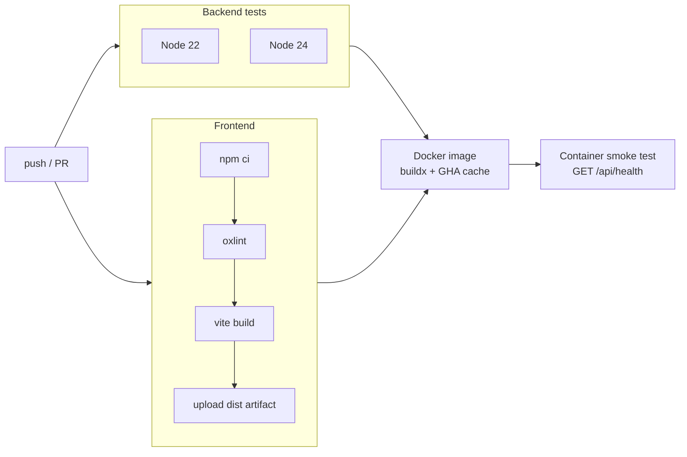

| Job | Steps | Gate |
|-----|-------|------|
| **Backend tests** | `npm ci` → `npm test` on a Node 22 × 24 matrix | All integration tests pass on both LTS lines |
| **Frontend lint & build** | `npm ci` → `oxlint` → `vite build` → upload `client/dist` artifact | Zero lint errors, successful production bundle |
| **Docker image** | Buildx with GitHub Actions layer cache → run container → poll `/api/health` until `"ok":true` | Image is runnable and self-seeds |

### Extending to CD

The workflow stops at a verified image. Typical next steps:

```yaml
# append to the docker job, guarded to main
- uses: docker/login-action@v3
  if: github.ref == 'refs/heads/main'
  with: { registry: ghcr.io, username: ${{ github.actor }}, password: ${{ secrets.GITHUB_TOKEN }} }
- uses: docker/build-push-action@v6
  if: github.ref == 'refs/heads/main'
  with:
    context: .
    push: true
    tags: ghcr.io/${{ github.repository }}:latest,ghcr.io/${{ github.repository }}:${{ github.sha }}
```

Then deploy with your platform of choice — Fly.io / Render / Railway (single container + volume), ECS/Fargate with EFS, or Kubernetes with a `PersistentVolumeClaim` for `/data`.

### Branch conventions

- `main` — protected; requires green CI.
- `arena/**`, `feat/**`, `fix/**` — working branches; PR into `main`.
- Commit messages follow [Conventional Commits](https://www.conventionalcommits.org/) (`feat:`, `fix:`, `chore:`, `docs:`).

---

## 11. Screenshots

| | |
|---|---|
| **Dashboard**: KPIs, spend by service/provider, budgets, alerts, top savings<br/>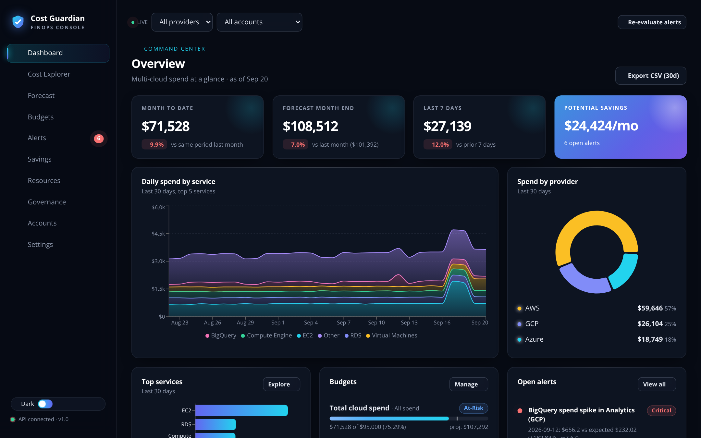 | **Cost Explorer**: group by any dimension, stacked/line, sortable breakdown<br/>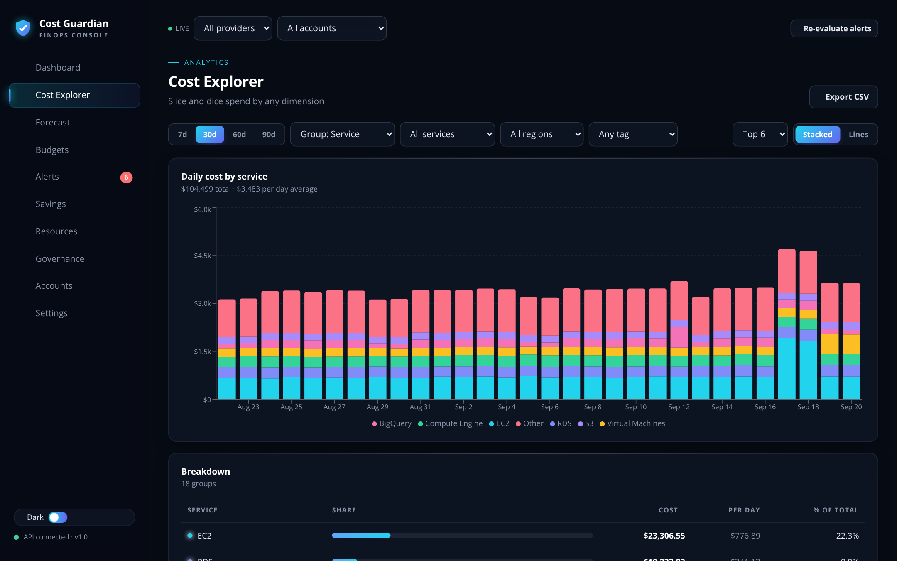 |
| **Forecast**: OLS trend with 80 % band and month-end projection<br/>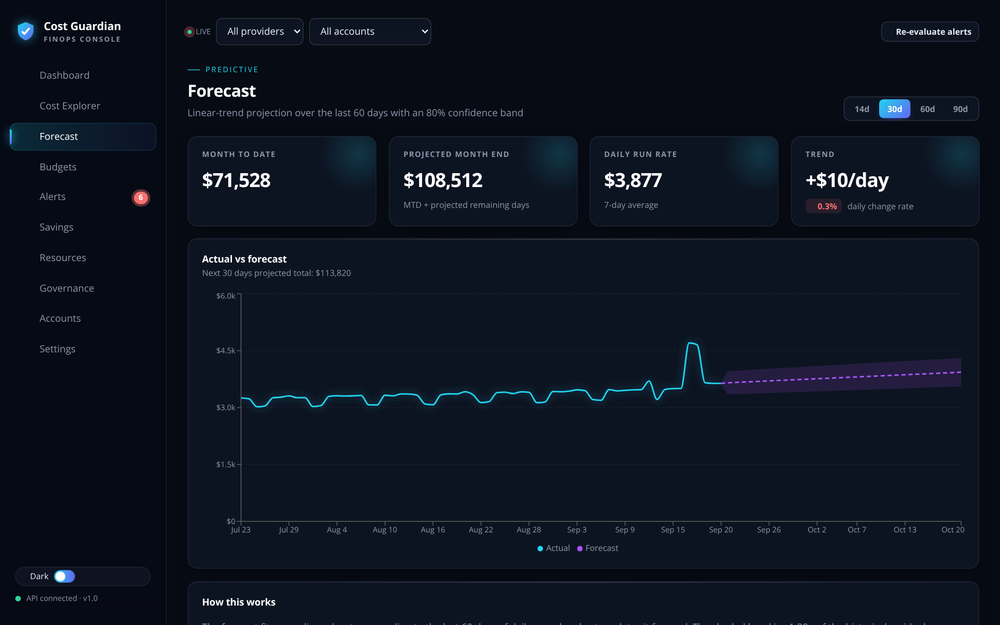 | **Budgets**: scoped budgets with thresholds and run-rate status<br/>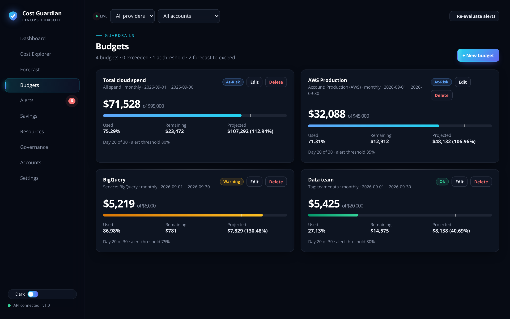 |
| **Alerts**: lifecycle management + anomaly detector table<br/>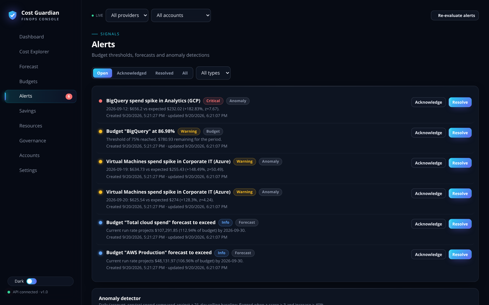 | **Savings**: ranked recommendations with $/effort/risk<br/>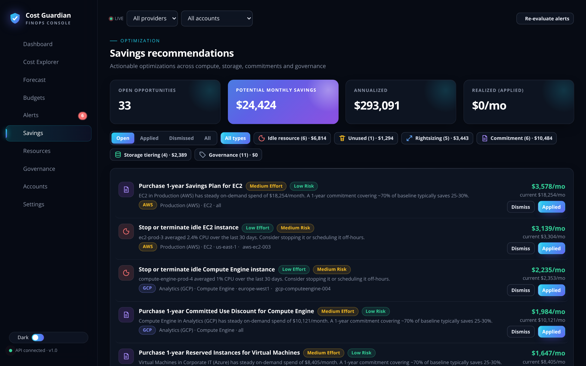 |
| **Resources**: inventory, utilisation, inline tag editing<br/>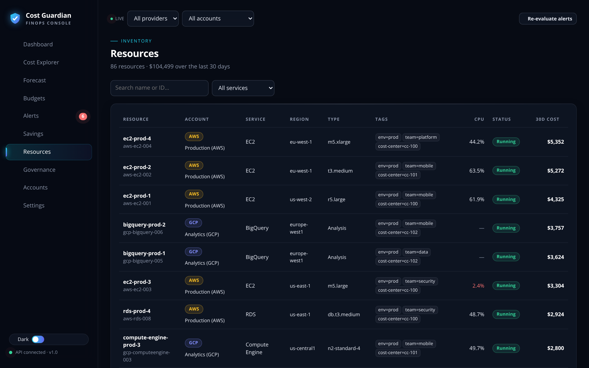 | **Governance**: tag compliance and violations<br/>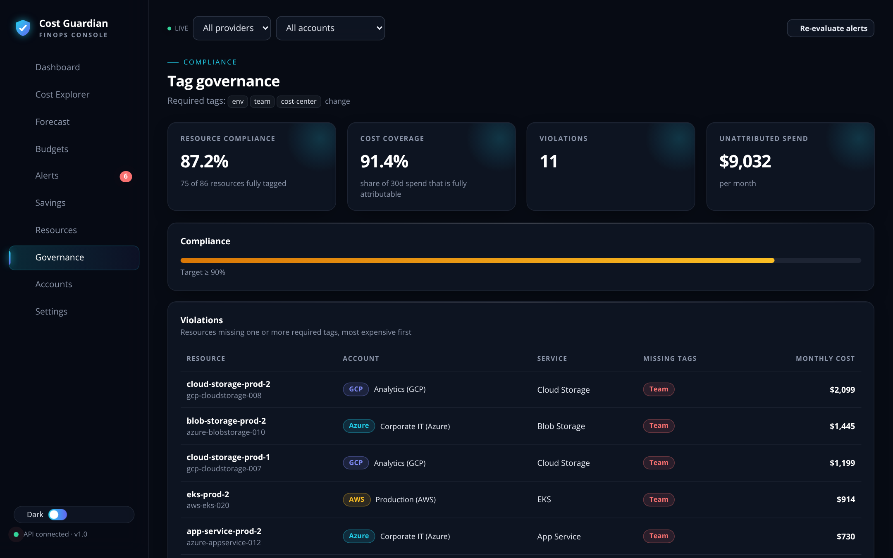 |

---

## 12. Demo

### Run locally (2 minutes)

Requires **Node ≥ 22.5**.

```bash
git clone https://github.com/aikanii/Cloud-Cost-Guardian.git
cd Cloud-Cost-Guardian
npm run install:all      # server + client deps
npm run dev              # API :4000 · UI :5173 (proxies /api)
```

Open **http://localhost:5173**. On first start the API creates the database and seeds a realistic 120-day, 4-account demo dataset, then evaluates alerts — you land on a populated dashboard with live budgets, ~8 open alerts and ~$24k/month of savings opportunities.

### Guided tour

1. **Dashboard** — note the *Forecast month end* KPI and the pulsing alert badge in the sidebar.
2. **Alerts** — three anomaly alerts correspond to spikes seeded in EC2 (AWS prod), BigQuery (GCP) and Virtual Machines (Azure). Acknowledge one, then click *Re-evaluate alerts* — it stays acknowledged.
3. **Forecast** — switch the global provider filter to **GCP** and the horizon to **90d**; the projection and band recalculate for that slice.
4. **Budgets** — create a budget scoped to `tag = team=data` with a 60 % threshold; a warning alert appears immediately.
5. **Savings** — filter to *Commitment*; mark one *Applied* and watch the *Realized* KPI update.
6. **Resources** — search `idle`-looking rows (CPU < 5 % shown in red), open one, add an `owner=` tag and save; **Governance** compliance moves.
7. **Explorer** — group by *Team tag* over 90 days, switch to *Lines*, export the CSV.
8. **Settings** → *Regenerate demo data* resets everything.

### Feed it real data

```bash
curl -X POST localhost:4000/api/costs/ingest -H 'content-type: application/json' -d '[
  {"accountId":1,"date":"2026-09-21","service":"EC2","region":"us-east-1","cost":812.4,"tags":{"team":"web","env":"prod"}},
  {"accountId":3,"date":"2026-09-21","service":"BigQuery","region":"us-central1","cost":1290.0,"tags":{"team":"data","env":"prod"}}
]'
```

Map your provider's export columns to this shape (AWS CUR `line_item_*`, Azure `Cost Management` CSV, GCP `billing_export` table) with any ETL tool or a short script, and schedule it daily.

---
=======
# Cloud Cost Guardian

A self-hosted, multi-cloud **FinOps dashboard** that gives you visibility and control over AWS, Azure and GCP spend:

- **Overview dashboard** – month-to-date, forecasted month-end, 7/30-day trends, spend by provider/service, budget health, open alerts and top savings.
- **Cost Explorer** – slice daily spend by service, account, provider, region or tag (team / env / cost-center), with stacked or line charts, sortable breakdowns and CSV export.
- **Forecasting** – least-squares trend projection with an 80 % confidence band and month-end estimate; works with any filter.
- **Budgets** – monthly / quarterly / yearly budgets scoped to all spend, an account, a service or a tag, with thresholds, run-rate projection and status (ok · at-risk · warning · exceeded).
- **Alerts** – automatic evaluation (on start, every 15 min, or on demand) of budget thresholds, forecast overruns and **statistical anomaly detection** (rolling 21-day z-score per account+service). Acknowledge / resolve / reopen lifecycle; alerts never re-open once handled.
- **Savings recommendations** – idle instances, unattached volumes, rightsizing, commitment discounts (Savings Plans / CUDs / RIs), storage tiering and missing-tag governance, each with estimated monthly savings, effort and risk. Mark as applied or dismissed.
- **Resources** – inventory with 30-day cost, CPU utilisation, tags and status; inline tag/status editing with a per-resource cost sparkline.
- **Tag governance** – compliance % against a configurable required-tag policy, cost coverage, and a violation list.
- **Accounts** – connect/disconnect AWS, GCP and Azure accounts; ingest billing data through the REST API.
- Dark mode, global provider/account filters, CSV exports and a fully documented JSON API.

The app ships with a deterministic **demo dataset** (4 accounts, ~86 resources, 120 days of costs including injected spikes and idle resources) so every feature is functional out of the box.

## Tech stack

| Layer | Tech |
|-------|------|
| Backend | Node 22, Express, built-in `node:sqlite` (no native build step) |
| Frontend | React 19, Vite, Recharts |
| Tests | `node:test` integration suite against the HTTP API |

## Getting started

Requires **Node ≥ 22.5** (for the built-in SQLite module).

```bash
npm run install:all        # installs server + client dependencies
npm run dev                # API on :4000, web UI on :5173 (proxied to the API)
```

Open http://localhost:5173. The database is created and seeded automatically on first start.

Other scripts:

```bash
npm test            # backend integration tests
npm run build       # production build of the client into client/dist
npm start           # serves API + built client from a single process on :4000
npm run seed        # regenerate demo data
npm run lint        # lint the client
```

### Docker

```bash
docker build -t cloud-cost-guardian .
docker run -p 4000:4000 -v ccg-data:/data cloud-cost-guardian
```

### Configuration (`server/.env.example`)

| Variable | Default | Description |
|----------|---------|-------------|
| `PORT` | `4000` | API port |
| `HOST` | `0.0.0.0` | Bind address |
| `DB_PATH` | `server/data/guardian.db` | SQLite file (`:memory:` for ephemeral) |
| `ALERT_INTERVAL_MS` | `900000` | Alert evaluation interval |

## Ingesting real billing data

Post normalised cost lines (e.g. from AWS CUR, Azure Cost Management exports or GCP billing BigQuery exports):

```bash
curl -X POST localhost:4000/api/costs/ingest -H 'content-type: application/json' -d '[
  { "accountId": 1, "date": "2026-09-20", "service": "EC2", "region": "us-east-1",
    "usageType": "BoxUsage", "usageQuantity": 24, "cost": 4.61, "tags": { "team": "web", "env": "prod" } }
]'
```

## API

All endpoints are under `/api`. Cost endpoints accept the filters `start`, `end` (or `days`), `accountId`, `provider`, `service`, `region`, `tag=key=value`.

| Method & path | Purpose |
|---------------|---------|
| `GET /health` | Liveness + entry count |
| `GET/POST/DELETE /accounts` | Cloud accounts |
| `GET /costs/summary` | KPI summary with period-over-period deltas |
| `GET /costs/daily` | Daily totals |
| `GET /costs/breakdown?groupBy=` | Totals by `service|account|provider|region|team|env|cost-center` |
| `GET /costs/daily-breakdown?groupBy=&limit=` | Daily stacked series (top N + Other) |
| `GET /costs/forecast?horizon=` | Trend forecast with confidence band |
| `GET /costs/export?format=csv|json` | Raw export |
| `GET /costs/filters` | Available filter values |
| `POST /costs/ingest` | Bulk insert |
| `GET /resources`, `GET /resources/:id/costs`, `PATCH /resources/:id` | Inventory |
| `GET/POST /budgets`, `PUT/DELETE /budgets/:id` | Budgets with live status |
| `GET /alerts`, `PATCH /alerts/:id`, `POST /alerts/evaluate` | Alert lifecycle |
| `GET /anomalies` | Anomaly detector output |
| `GET /recommendations`, `POST /recommendations/:fingerprint/:action` | Savings (`applied` / `dismissed` / `open`) |
| `GET /governance/tags` | Tag compliance |
| `GET/PUT /settings` | Required tags etc. |
| `POST /admin/reseed` | Regenerate demo data |

## Project layout

```
.
├── .github/workflows/ci.yml     CI pipeline
├── Dockerfile                   Multi-stage production image
├── package.json                 Root scripts (dev, test, build, lint)
├── server/
│   ├── src/
│   │   ├── index.js             Bootstrap, seeding, scheduler
│   │   ├── app.js               Express API
│   │   ├── analytics.js         Aggregation · forecast · anomalies · recommendations · budgets · alerts · governance
│   │   ├── db.js                SQLite schema & helpers
│   │   ├── seed.js              Deterministic demo data
│   │   └── util.js              Dates, stats, errors
│   └── test/api.test.js         Integration suite
└── client/
    ├── vite.config.js           Dev server + /api proxy
    └── src/
        ├── App.jsx              Shell, routing, global filters, theme
        ├── pages/               Dashboard · Explorer · Forecast · Budgets · Alerts · Recommendations · Resources · Governance · Accounts · Settings
        ├── components/ui.jsx    Cards, KPIs, badges, modal, skeletons, tooltips
        └── lib/                 API client, formatters, contexts
=======
server/src/db.js         SQLite schema & helpers
server/src/seed.js       Deterministic demo data generator
server/src/analytics.js  Aggregations, forecast, anomaly detection, recommendations, budgets, alerts
server/src/app.js        Express API
server/test/             Integration tests
client/src/pages/        Dashboard, Explorer, Forecast, Budgets, Alerts, Savings, Resources, Governance, Accounts, Settings
client/src/components/   Shared UI primitives
client/src/lib/          API client, formatters, contexts
>>>>>>> Stashed changes
```

## License

Updated upstream
MIT © Cloud Cost Guardian contributors
=======
MIT
